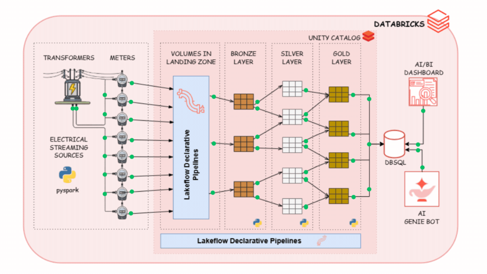
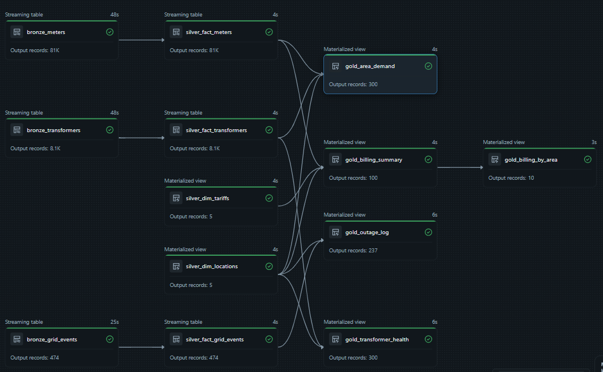
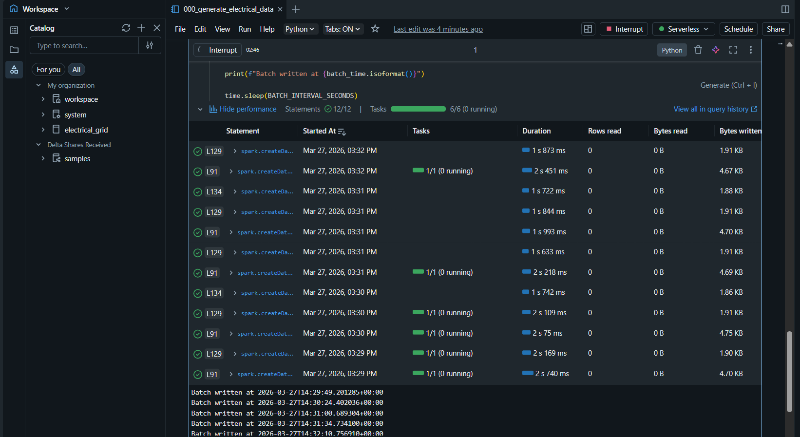

# End-to-End Data Engineering of a Real-Time Electrical Grid Streaming Pipeline on Databricks

## Navigation / Quick Access

- [Overview](#overview)
- [Project Goal](#project-goal)
- [Project Architecture (Medallion)](#data-architecture-medallion)
- [Source Dataset](#source-dataset)
- [Gold Layer – Final Tables](#gold-layer--final-tables)
- [How to Reproduce](#how-to-reproduce)

---

## Overview

This project simulates a real-time electrical grid monitoring system and builds a production-grade streaming data pipeline entirely inside **Databricks** using the medallion architecture.

The data source is a **synthetic IoT stream** generated by a PySpark simulator [as highlighted here](https://github.com/EdidiongEsu/electrical_grid/tree/main/data_generation). This mimics the behaviour of 50 smart meters and 5 distribution transformers. The simulator generates realistic voltage, current, power, and energy readings every 30 seconds, and randomly triggers transformer outages with automatic recovery, replicating real-world auto-recloser behaviour on a distribution grid.

Raw streaming data lands in **Delta Lake volumes** under a Unity Catalog landing zone. **Lakeflow Declarative Pipelines** then process the data through Bronze, Silver, and Gold layers, delivering clean, enriched tables ready for AI/BI dashboards and an AI Genie Bot.

---

## Project Goal

- Simulate a live electrical grid IoT stream using PySpark
- Ingest raw meter, transformer, and event data into a Delta Lake landing zone
- Build a documented Bronze → Silver → Gold medallion pipeline using Lakeflow Declarative Pipelines
- Deliver Gold tables optimized to answer operational and analytical questions about grid health and energy costing.
- Use BI dashboard and AI Genie Bot to successsfully Visualize and ask questions about electrical grid, performance and reliability.

---

## Data Architecture (Medallion)



### Medallion Layers & Data Flow

The pipeline follows a clean **Bronze → Silver → Gold** medallion pattern inside Databricks Unity Catalog:

- **Landing Zone**: 3 raw Delta volumes ingested every 30 seconds from the PySpark simulator (`/meters/`, `/transformers/`, `/grid_events/`)
- **Bronze**: Raw data read from landing zone volumes with no transformations — schema enforced, ingestion timestamp preserved
- **Silver**: Cleaned, typed, and enriched Delta tables — nulls handled, outage flags derived, meter-to-transformer relationships resolved
- **Gold**: Business-ready tables for operational monitoring and analytics — aggregated load metrics, outage summaries, electricity billing consumption

**High-level DAG Pipeline diagram**



---

## Source Dataset

For a more teailed breakdown of how the data generator works please [click here](https://github.com/EdidiongEsu/electrical_grid/tree/main/data_generation).
Data is generated synthetically by the simulator notebook `000_generate_electrical_data.ipynb`. It writes to the following **Unity Catalog Delta Lake volumes** every 30 seconds:

```
/Volumes/electrical_grid/00_landing_zone/electrical_stream/
├── meters/
├── transformers/
└── grid_events/
```

| Volume | Approx. rows/hour | Description |
|---|---|---|
| `meters/` | ~6,000 | One reading per meter per batch — voltage, current, power, energy |
| `transformers/` | ~600 | One reading per transformer per batch — load, capacity, status |
| `grid_events/` | Variable | Logged only on outage start (`breaker_trip`) or recovery (`breaker_reclose`) |

### Simulator overview

| Parameter | Value | Description |
|---|---|---|
| Smart meters | 50 | 10 meters assigned per transformer |
| Transformers | 5 | 500 kVA rated capacity each |
| Batch interval | 30 sec | How often a new batch of readings is written |
| Outage probability | 3% | Per-batch chance a transformer trips |
| Outage duration | 3 batches (~90 sec) | Transformer auto-recovers after this |
| Event-time latency | Up to 20 sec | Simulated sensor delay behind batch time |

---
### Gold Layer – Final Tables
5 production-ready tables powering all dashboards, DBSQL queries, and the AI Genie Bot. This is in the schema `electrical_grid.03_gold`. A more detailed breakdown of the data structure are highlighed [here](https://github.com/EdidiongEsu/electrical_grid/tree/main/lakeflow_pipeline)
 
| Table | Description |
|---|---|
| `gold_area_demand` | 15-min geo-tagged demand per transformer — load kW, apparent load kVA, load %, headroom, avg voltage and power factor |
| `gold_billing_summary` | Daily energy consumption and estimated cost per meter using NERC SRT tariff band rates (₦) |
| `gold_billing_by_area` | Daily billing aggregated by area and service band — total kWh, total cost (₦), active meter count |
| `gold_outage_log` | One row per outage — trip/reclose event pair with duration in minutes and full location context |
| `gold_transformer_health` | 15-min windowed transformer health — avg/peak load %, avg/peak load kW, offline minutes, uptime % |
 
 
## How to Reproduce
 
This project uses a **PySpark simulator** to generate streaming data into Delta Lake, and **Lakeflow Declarative Pipelines** to process it through the medallion layers inside Databricks.
 
Follow the steps below to recreate the environment.
 
### 1. Set Up Databricks Workspace
 
- Go to [https://databricks.com](https://databricks.com) and sign in
- Ensure your workspace has **Unity Catalog** enabled
- You will need access to: Notebooks, Delta Live Tables / Lakeflow, DBSQL, and AI/BI Dashboards
 
### 2. Create the Unity Catalog Structure
 
In your Unity Catalog, create the following:
 
```
Catalog:   electrical_grid
Schemas:   00_landing_zone · 01_bronze · 02_silver · 03_gold
Volumes:
  └── 00_landing_zone/electrical_stream/
        ├── meters/
        ├── transformers/
        └── grid_events/
```
 
- Go to **Data** → **Unity Catalog** → create catalog `electrical_grid`
- Create schemas: `00_landing_zone`, `01_bronze`, `02_silver`, `03_gold`
- Inside `00_landing_zone`, create a **Managed Volume** named `electrical_stream`
 
### 3. Run the Data Generator
 
- Open `000_generate_electrical_data.ipynb` in your Databricks workspace
- Attach it to a running cluster
- Run all cells — the simulator will start writing batches every 30 seconds and print confirmations:
 
```
Batch written at 2024-11-01T10:30:00+00:00
```
 
> Keep this notebook running while you set up the pipeline. Interrupt it when you want to stop data generation.
 

 
### 4. Create the Lakeflow Declarative Pipeline
 
- In your workspace → **New** → **Pipeline** (Lakeflow / Delta Live Tables)
- Name the pipeline: `electrical_grid_pipeline`
- Set the pipeline mode to **Continuous** for real-time streaming
 
Connect the pipeline notebooks in order:
 
| Notebook | Layer | Tables created |
|---|---|---|
| `001_bronze.ipynb` | Bronze | `bronze_meters`, `bronze_transformers`, `bronze_grid_events` |
| `002_silver.ipynb` | Silver | `silver_fact_meters`, `silver_fact_transformers`, `silver_fact_grid_events`, `silver_dim_locations`, `silver_dim_tariffs` |
| `003_gold.ipynb` | Gold | `gold_area_demand`, `gold_billing_summary`, `gold_billing_by_area`, `gold_outage_log`, `gold_transformer_health` |
 

 
### 5. Configure the Pipeline
 
In the pipeline settings:
 
- **Storage location**: point to your Unity Catalog (e.g. `electrical_grid.pipeline_storage`)
- **Target schema**: tables are written directly to `electrical_grid.01_bronze`, `02_silver`, `03_gold` as declared in each notebook
- **Cluster**: use a cluster with Photon enabled for best Delta streaming performance
 
### 6. Run the Pipeline
 
- Click **Start** to trigger the pipeline
- Wait for all three layers to complete successfully
 

 
Verify all 13 tables have been created across `01_bronze`, `02_silver`, and `03_gold` in Unity Catalog.
 
### 7. Connect to Databricks SQL
 
- Open **Databricks SQL** → **Query Editor**
- Select the `electrical_grid` catalog and begin querying Gold tables:
 
```sql
-- Transformers approaching capacity
SELECT transformer_id, area_name, service_band, avg_load_pct, peak_load_pct, uptime_pct
FROM electrical_grid.03_gold.gold_transformer_health
WHERE window_start >= dateadd(HOUR, -1, current_timestamp())
ORDER BY peak_load_pct DESC;
 
-- Daily billing by area
SELECT date, area_name, service_band, total_kwh, total_cost_naira, active_meters
FROM electrical_grid.03_gold.gold_billing_by_area
ORDER BY date DESC, total_cost_naira DESC;
 
-- Recent outages with duration
SELECT transformer_id, area_name, outage_start, duration_minutes
FROM electrical_grid.03_gold.gold_outage_log
ORDER BY outage_start DESC;
```
 

 
### 8. Set Up AI/BI Dashboard
 
- In Databricks → **AI/BI** → **New Dashboard**
- Connect to your Gold tables in `electrical_grid.03_gold`
- Recommended visualisations:
  - Real-time transformer load % map (geo-tagged from `gold_area_demand`)
  - Outage frequency and duration trends by area (from `gold_outage_log`)
  - Daily energy cost by area and service band (from `gold_billing_by_area`)
  - Transformer uptime % over time (from `gold_transformer_health`)
 

 
### 9. AI Genie Bot (Optional)
 
- In Databricks → **AI/BI** → **Genie**
- Connect Genie to schema `electrical_grid.03_gold`
- Ask natural language questions like:
  - *"Which transformer had the most outages this week?"*
  - *"What is the total energy cost for Lekki this month?"*
  - *"Show transformers with uptime below 95% in the last 24 hours"*
  - *"Which service band has the highest average daily consumption?"*
 

 
---
 
## Dependencies
 
- Databricks Runtime with PySpark and Delta Lake
- Unity Catalog enabled workspace
- Lakeflow Declarative Pipelines (Delta Live Tables)
- Databricks SQL warehouse
- AI/BI Dashboards and Genie (optional)
