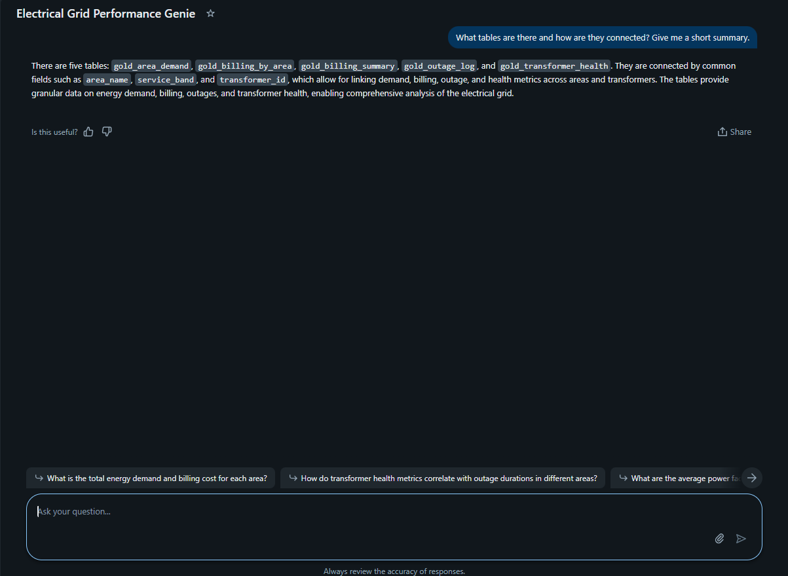
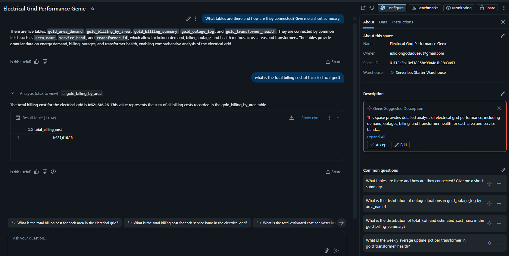
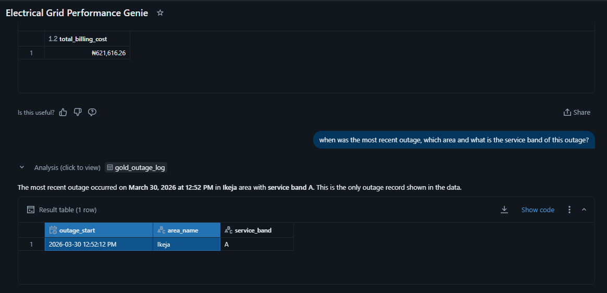
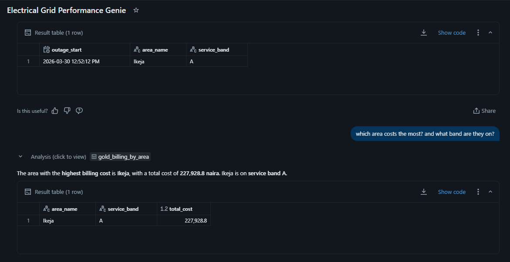
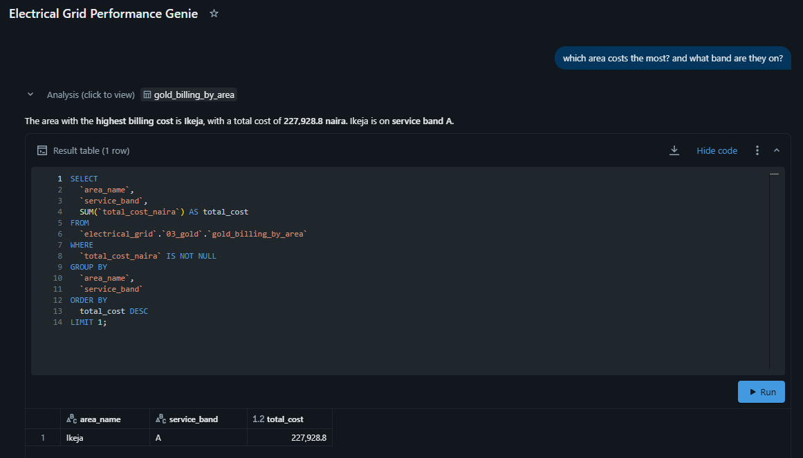

# AI Genie Bot for Electrical Grid
To setup the ai genie, you will have to connect gold tables to the ai genie on databricks.
Refer to main [readme](https://github.com/EdidiongEsu/electrical_grid/tree/main?tab=readme-ov-file#ai-genie-bot) to see how to setup the dashboards.

## AI Electrical Grid Genie in Action
Refer to the below snapshot to see the genie bot in action:

